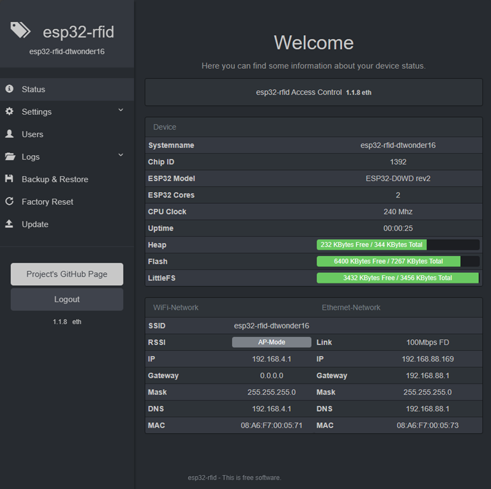

# ESP32-RFID - Access Control with ESP32 and Wiegand

[This Project is a Port for ESP32 from ESP-RFID](https://github.com/esprfid/esp-rfid)


Access Control system using a Wiegand RFID readers and Espressif's ESP32 Microcontroller. 



     
This is the first prototype with a dtwonder board and a 58bit wiegand reader.

## Index
* [Features](#features)
  * [For Users](#for-users)
  * [For Tinkerers](#for-tinkerers)
* [Getting Started](#getting-started)
* [Hardware](#hardware)
  * [What You Will Need](#what-you-will-need)
  * [ESP32 Boards](#esp32-boards)
  * [Pin Layout](#pin-layout)
* [Software](#software)
  * [Using Compiled Binaries](#using-compiled-binaries)
  * [Building With PlatformIO](#building-with-platformio)
  * [Useful Commands](#useful-commands)
* [MQTT](#mqtt)
* [Time](#time)
* [User Instructions](#user-instructions)
  * [Installation](@installation)
* [Known Issues](#known-issues)
* [Security](#security)
* [Changelog](#changelog)
* [My Projects Based On ESP-RFID](#my-projects-based-on-esp-rfid)
* [License](#license)

## Features
### For Users
* Minimal effort for setting up your Access Control system, just flash and everything can be configured via Web UI
* Capable of managing up to 1.000 Users (even more is possible)
* Great for Maker Spaces, Labs, Schools, etc
* Cheap to build and easy to maintain
### For Tinkerers
* Open Source (minimum amount of hardcoded variable, this means more freedom)
* Using WebSocket protocol to exchange data between Hardware and Web Browser
* Data is encoded as JSON object
* Records are Timestamped (Time synced from a NTP Server)
* MQTT enabled
* Bootstrap, jQuery, FooTables for beautiful Web Pages for both Mobile and Desktop Screens
* Thanks to ESPAsyncWebServer Library communication is Asynchronous

## Getting Started
This project still in its development phase. New features (and also bugs) are introduced often and some functions may become deprecated. Please feel free to comment or give feedback.

* Get the latest release from [here](https://github.com/pvtex/esp32-rfid/releases).
* See [Known Issues](#known-issues) before starting right away.
* See [Security](#security) for your safety.
* See [ChangeLog](CHANGELOG.md)

## Hardware
### What You Will Need
* An ESP32 module or a development board with at least **32Mbit Flash (equals to 4MBytes)** **128MBit Flash (equals to 16MBytes) is much better**
* 4 port Level Shifter for connecting the Wiegand reader to ESP32 (needed for D0, D1, Buzzer and LED)
* Wiegand based RFID reader (any with a bit count of 26 to 58 will work, including keypad)
* A Relay Module (or you can build your own circuit, all boards described below have 1 or 2 relays on board)
* n quantity of RFID Tags (for example Mifare Classic 1KB , or any other Tag with a 4 or 7byte ID) equivalent to User Number

### ESP32-Boards
currently ESP32-RFID supports 4 types of boards:

| Board | Flash | WiFi | LAN | Picture | 3D | image | debug-image |
|:-----:|:-----:|:----:|:---:|:-------:|:--:|:-----:|:-----------:|
| generic | 4MB | :heavy_check_mark: | :heavy_multiplication_x: | | | [wifi.bin](https://github.com/pvtex/esp32-rfid/raw/master/bin/wifi.bin) | [wifi-debug.bin](https://github.com/pvtex/esp32-rfid/raw/master/bin/wifi-debug.bin) |
| APWIKOGER Relay-X1 | 4MB | :heavy_check_mark: | :heavy_multiplication_x: | [:camera_flash:](./boards/APWIKOGER-Relay-X1/board.png) | [3D](./boards/APWIKOGER-Relay-X1/front.png) | [wifi-apwikoger.bin](https://github.com/pvtex/esp32-rfid/raw/master/bin/wifi-apwikoger.bin) | [wifi-apwikoger-debug.bin](https://github.com/pvtex/esp32-rfid/raw/master/bin/wifi-apwikoger-debug.bin) |
| DTWonder DT-R002 | 4MB | :heavy_check_mark: | :heavy_check_mark: | [:camera_flash:](./boards/dtwonder-DT-R002/board.png) | [3D](./boards/dtwonder-DT-R002/front.png) | [ethernet-dtwonder.bin](https://github.com/pvtex/esp32-rfid/raw/master/bin/ethernet-dtwonder.bin) | [ethernet-dtwonder-debug.bin](https://github.com/pvtex/esp32-rfid/raw/master/bin/ethernet-dtwonder-debug.bin) |
| DTWonder DT-R002 | 16MB | :heavy_check_mark: | :heavy_check_mark: | [:camera_flash:](./boards/dtwonder-DT-R002/board.png) | [3D](./boards/dtwonder-DT-R002/front.png) | [ethernet-dtwonder-16M.bin](https://github.com/pvtex/esp32-rfid/raw/master/bin/ethernet-dtwonder-16M.bin) | [ethernet-dtwonder-16M-debug.bin](https://github.com/pvtex/esp32-rfid/raw/master/bin/ethernet-dtwonder-16M-debug.bin) |
| lilygo t-internet-com | 16MB | :heavy_check_mark: | :heavy_check_mark: | [:camera_flash:](./boards/t-internet-com/board.jpg) | [3D](./boards/t-internet-com/front_v2.png) | [ethernet-lilygo.bin](https://github.com/pvtex/esp32-rfid/raw/master/bin/ethernet-lilygo.bin) | [ethernet-lilygo-debug.bin](https://github.com/pvtex/esp32-rfid/raw/master/bin/ethernet-lilygo-debug.bin) |

You can find pictures of each board and the wiegand adapter in the board subfolder and     
a gerber file for an adapter board to wiegand interface, door status and exit button.    

| Board | Gerber | BOM | PickandPlace | 
|:-----:|:------:|:---:|:------------:|
| APWIKOGER Relay-X1 | [gerber](./boards/APWIKOGER-Relay-X1/Gerber.zip) | [BOM](./boards/APWIKOGER-Relay-X1/BOM.xlsx) | [PaP](./boards/APWIKOGER-Relay-X1/PickAndPlace.xlsx) |
| DTWonder DT-R002 | [gerber](./boards/dtwonder-DT-R002/Gerber.zip) | [BOM](./boards/dtwonder-DT-R002/BOM.xlsx) | [PaP](./boards/dtwonder-DT-R002/PickAndPlace.xlsx) |
| lilygo t-internet-com | [gerber](./boards/t-internet-com/Gerber.zip) | [BOM](./boards/t-internet-com/BOM.xlsx) | [PaP](./boards/t-internet-com/PickAndPlace.xlsx) |

### Pin Layout

The following table shows the typical pin layout used for connecting readers hardware to ESP:

| ESP32      | generic | APWIKOGER |DTWonder  | DTWonder 16M | lilygo    |
|-----------:|:-------:|:---------:|:--------:|:------------:|:---------:|
| Connection | WiFI    | WiFi      | ETH+WiFi | ETH+WiFi     | ETH+WiFi  |
| GPIO-1     |         |           | LED      | LED          |           |
| GPIO-2     |         |           | Relay 2  | Relay 2      | D1        |
| GPIO-3     |         |           | Buzzer   | Buzzer       |           |
| GPIO-4     | D0      |           | D0       | D0           |           |
| GPIO-5     | D1      |           | D1       | D1           |           |
| GPIO-12    | LED     |           |          |              |           |
| GPIO-13    | Buzzer  | Buzzer    | Buzzer   | Buzzer       | LED       |
| GPIO-14    | Door    | LED       | LED      | LED          | D0        |
| GPIO-15    | Exit    |           |          |              | Buzzer    |
| GPIO-16    | Relay 1 | Relay 1   | Relay 1  | Relay 1      |           | 
| GPIO-17    |         | Door      |          |              |           | 
| GPIO-18    |         | Exit      |          |              |           |
| GPIO-26    |         | D0        |          |              |           |
| GPIO-32    |         |           |          |              | Relay 1   |
| GPIO-33    |         | D1        |          |              | Door      |
| GPIO-35    |         |           |          |              | Exit      |
| GPIO-36    |         |           | Door     | Door         |           |
| GPIO-39    |         |           | Exit     | Exit         |           |
    
     
## Software

### Using Compiled Binaries
Download compiled binaries from GitHub Releases page
https://github.com/pvtex/esp32-rfid/releases

On Windows you can use **"flash.bat"**, it will ask you which COM port that ESP is connected and then flashes it. You can use any flashing tool and do the flashing manually. The flashing process itself has been described at numerous places on Internet.

### Building With PlatformIO

The build environment is based on [PlatformIO](http://platformio.org). Follow the instructions found here: http://platformio.org/#!/get-started for installing it but skip the ```platform init``` step as this has already been done, modified and it is included in this repository. In summary:

```
sudo pip install -U pip setuptools
sudo pip install -U platformio
git clone https://github.com/pvtex/esp32-rfid.git
cd esp32-rfid
platformio run
```

When you run ```platformio run``` for the first time, it will download the toolchains and all necessary libraries automatically.      

**!!! IMPORTANT !!!**   
If you use the DTWonder DR-R002 board you have to patch the ethernet library if you want to compile the firmware on your own.     
All needed information can be found [here](./boards/dtwonder-DT-R002/PATCH/).     
**!!! IMPORTANT !!!** 

### Useful commands

* ```platformio run``` - process/build all targets
* ```platformio run -e generic -t upload``` - process/build and flash just the ESP12e target (the NodeMcu v2)
* ```platformio run -t clean``` - clean project (remove compiled files)

The resulting (built) image(s) can be found in the directory ```/bin``` created during the build process.

## MQTT
You can integrate ESP32-RFID with other systems using MQTT. Read the [additional documentation](./README-MQTT.md) for all the details.

## Time
We are syncing time from a NTP Server (in Client -aka infrastructure- Mode). This will require ESP to have an Internet connection. Additionally your ESP32 can also work without Internet connection (Access Point -aka Ad-Hoc- Mode), without giving up functionality.
This will require you to sync time manually. ESP32 can store and hold time for you approximately 51 days without major issues, device time can drift from actual time depending on usage, temperature, etc. so you have to login to settings page and sync it in a timely fashion.
Timezones are supported with automatic switch to and from daylight saving time.

## User Instructions

### Installation
* First, flash firmware (you can use /bin/flash.bat on Windows) to your ESP either using Arduino IDE or with your favourite flash tool
* (optional) Fire up your serial monitor to get informed
* Search for Wireless Network "esp32-rfid-xxxxxx" and connect to it (It should be an open network and does not require password)
* Open your browser and visit either "http://192.168.4.1" or "http://esp32-rfid.local" (.local needs Bonjour installed on your computer).
* Log on to ESP32, default password is "admin"
* Go to "Settings" page
* Configure your amazing access control device. Push "Scan" button to join your wireless network, configure RFID hardware, Relay Module.
* Save settings, when rebooted your ESP32 will try to join your wireless network.
* Check your new IP address from serial monitor and connect to your ESP again. (You can also connect to "http://esp32-rfid.local")
* Go to "Users" page
* Scan a PICC (RFID Tag) then it should glimpse on your Browser's screen.
* Type "User Name" or "Label" for the PICC you scanned.
* Choose "Allow Access" if you want to
* Click "Add"
* Congratulations, everything went well, if you encounter any issue feel free to ask help on GitHub.


## Known Issues
* Please also check [GitHub issues](https://github.com/pvtex/esp32-rfid/issues).

## Security
We assume **ESP32-RFID** project -as a whole- does not offer strong security. There are PICCs available that their UID (Unique Identification Numbers) can be set manually (Currently esp-rfid relies only UID to identify its users). Also there may be a bug in the code that may result free access to your belongings. And also, like every other network connected device es32p-rfid is vulnerable to many attacks including Man-in-the-middle, Brute-force, etc.

This is a simple, hobby grade project, do not use it where strong security is needed.

What can be done to increase security? (by you and by us)

* We are working on more secure ways to Authenticate RFID Tags.
* You can disable wireless network to reduce attack surface. (This can be configured in Web UI Settings page)
* Choose a strong password for the Web UI

## Changelog

See [ChangeLog](./CHANGELOG.md)

## My Projects Based On ESP-RFID

* [ESP-RFID v2](https://github.com/pvtex/esp-rfid) ESP-RFID v2 - Access Control with ESP8266 and Wiegand
* [ESP32-RFID](https://github.com/pvtex/esp32-rfid) ESP32-RFID - Access Control with ESP32 and Wiegand

## License
The code parts written by ESP-RFID project's authors are licensed under [MIT License](https://github.com/pvtex/esp32-rfid/blob/stable/LICENSE), 3rd party libraries that are used by this project are licensed under different license schemes, please check them out as well.
